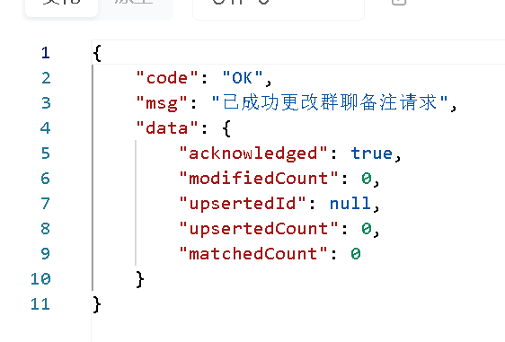

# Chatmore聊天室项目

### 项目简介

自2024/09/15开发的web聊天室项目。

#### 使用技术：

socket-io

前端：vue3+TypeScript+pinia+elementUI

后端：nodejs+mongodb

#### 功能介绍：

- 用户信息的修改
- 资料设置/修改
  - 好友信息修改（如备注）
  - 群聊资料修改（如群名称、群简介等）
- 群聊功能
  - 群管理功能：设置管理员/取消管理员/删除群成员
  - 发起群聊/加入群聊/邀请入群/退出群聊
- 私聊功能
  - 添加好友/删好友/模糊搜索用户
- 搜索功能：
  - 模糊搜索群/用户
- 图片发送、图片预览


#### 项目界面：


#### 部分功能展示：

搜索功能


发起群聊功能：


群聊管理功能：


### 开发日志

<details>
<summary>点击查看</summary>

#### 项目创建流程：基于 vite 创建

```
npm create vue@latest
pinia√
router√
```

#### 引入ant-design

```
npm install ant-design-vue@4.x --save
```

由于使用的是Vite，采用按需引入的方式：

https://antdv.com/docs/vue/introduce-cn

（后面改用elementui了）

#### 想法记录：

想要做有伸缩按钮的侧边栏（不适合，已pass

将数据存在pinia里，在pinia中初始化socket连接和监听socket事件。

#### 开发心路历程：

9.15~9.17

发送注册邮件，存储注册用户信息

token验证登录

查询用户是否存在，某用户是否为另一用户好友，查询群，查询用户是否在群中

获取用户信息，修改用户信息，用户的好友信息（备注）

9.18：

发送重置密码邮件，加载重置密码页面，重置密码

9.18~9.19：

发起好友请求，处理好友申请

文件上传

9.19~9.20：

建群，邀请入群，申请入群

（到9.20为止主要是后端开发）

9.20至10/19：

- 群功能重写&优化

- 私聊、群聊重写。

- 实现：实时聊天，实时发送、接收好友申请、加群申请，处理好友申请、群聊邀请9.25

- 首页界面构建：聊天信息+申请/邀请信息+好友列表

- 优化细节：消息滚动到底部、刷新聊天列表、在聊天列表中实时显示最新message和time。

10/13：

还在整理思路。

- 学习了mongodb假数据生成，不过生成的假数据细节处还有待优化。

- 发现pinia持久化插件会带来pinia数据更新慢的问题，不知是否因为localstorage存取引起，前段时间一直被这个问题折磨。

  （10/13，似乎还存在，但关闭后确实快了很多。）

  （11/10，发现其实是调试插件带来的问题，已解决。）

- 优化了关于计算群聊未读消息数的问题，可以给群成员设置lastViewedAt，然后和从低往高排序后的群消息比较，计算得到未读消息数。

- PersonCard组件应绑定点击事件，向index.vue传递id，然后index.vue再根据id生成聊天页面。

- GroupGather获取不到Message，还待解决。

```javascript
const groupMessagePromise = groupMap.map(async (item) => {
      const groupMessages = await Group_Message.find({ groupId: item.groupId }).sort({ timestamp: 1 });
      for (const message of groupMessages) {
        if (!userArr[message.userId]) {
          userArr[message.userId] = await this.userRepository.findOne({ userId: message.userId });
        }
      }
      return groupMessages;
    });
```

10/14：

GroupGather已经获取到Message！但我有个疑惑，为什么直接向find到的对象插入数据不行，重构融合后就行？这是个还待解决的问题。（已解决。）

userGather还有些问题。

pinia数据更新慢的问题解决了！！！退出重进会有上一个用户残留数据的问题也解决了，this.$reset()，以及在组件中引入pinia数据时要用computed

10/18：

优化了ChatList-PersonCard监听代码，减少了性能开销，以及新加了自动刷新聊天列表，将最新消息顶上前端的功能。遇到了很多bug。

```typescript
// 监听 messageGather 的变化
watch(() => chatStore.messageGather[id], (newMessageGather) => {
  if (id && newMessageGather && Array.isArray(newMessageGather)) {
    if (newMessageGather.length !== 0) {
      message.value = newMessageGather.at(-1).messageText;
    }
    //将刷新聊天列表的功能放到这里，这样无论是接还是收，只要messageGather改变了都可以刷新聊天列表
    const index=chatMap.value.findIndex(item=>item.id===id);
    const item = chatMap.value.splice(index,1)[0]
    item.timestamp=new Date()
    chatMap.value.unshift(item);
  }
}, { deep: true ,immediate:true}); // 深度监听
```

chatMap.splice返回的是Array，要想拿到被删除的数据需要配合索引值。

10/21~10/22：

- 发起加好友申请
- 通过/拒绝/忽视好友申请
- 好友申请被通过

问题：

10/23：

写到删除好友逻辑时发现，如果单纯地删除userGather中key为id的部分，会连同群成员信息、请求用户信息一起丢失，所以最好是userGather中存储基础信息，friendGather中存储好友信息，并将Member信息存入groupGather中。

删除的时候只需删除friendGather部分就可以。


userGather中存储基本信息：_id，username,state,profilePicture,signature


friendGather中存储好友信息：_id，createdAt，profilePicture，signature，lastViewedAt


MemberGather中存储群组成员信息？

将memberData存入groupGather里？

```
groupGather.members{

​	id{
		_id:...,
		role:...
​	}

}
```


有些冗余。


已开发到建群和邀请进群功能：

优化：点开群聊天页面时才获取相关members数据，也就将members的userDetail信息存入userGather中，然后在群中加入admin信息。

10/26：

优化一些细节。

接下来要做的事：

- search识别好友和非好友
- input框模糊搜索
- 解决点击聊天卡片跳转双页面bug（冒泡了
- 解决改变query参数但路由相同时页面不会跳转bug
- 监听socket事件发送通知
- 屏蔽群消息
- 群邀请
- 群资料修改页面
- 优化：??运算符

细枝末节bug：

- 邀请入群时初始页面的checkAll不会根据include自动变换



已实现：

- groupNickname更改 10.27
- 优化了getAllData中获取request的逻辑
- 退群
- 申请入群（广播所有管理员）（后面需要优化，入群的通知信息需要广播给所有在群内的群员）
- 优化了刷新页面重新connect到服务器的代码
- 优化了退出登录逻辑，防止页面跳转前token已经移除，造成退出时聊天页面仍旧进行路由请求的bug

待优化：senders和members最好合并到一起。（现在看来好像不是，公告信息不能广播给已经退群的sender）

优化群聊member结构

</details>

